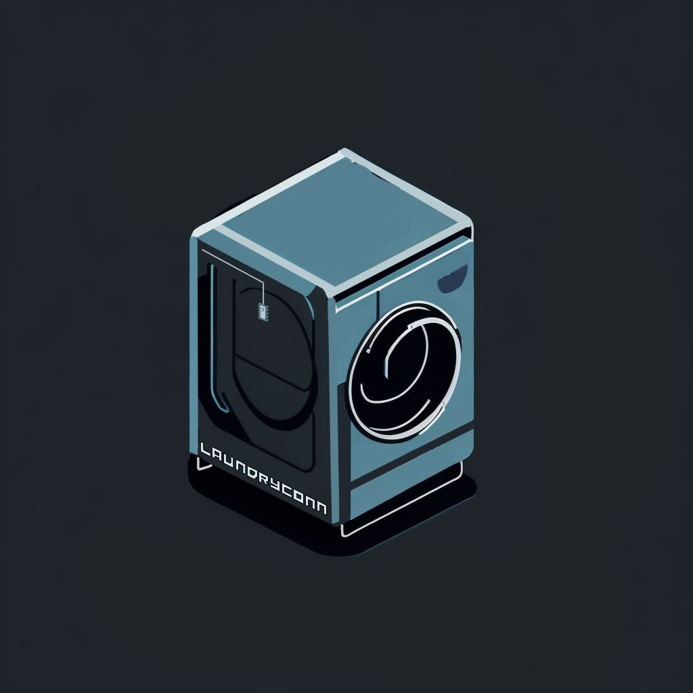

# LaundryConn



LaundryConn is a mobile application that allows users to view the status of laundry machines in their building. Users can also receive notifications when their laundry is done. It uses Raspberry pi picoW and vibration sensors to detect when a machine is running. The data is then sent to supbase which is then sent to this mobile app. 

## Built With
<div style="display:flex">


</div>

## Getting Started

```
create a new folder to store the project and run

git clone https://github.com/LaundryConn/MobileApp.git .
yarn
npx expo start
```

get icons from
https://oblador.github.io/react-native-vector-icons/

## Authors
- Aditya Chandraker - Lead Developer
- Sebastien - Developer
- Ben
- Sabrina
- Damon
- Sai